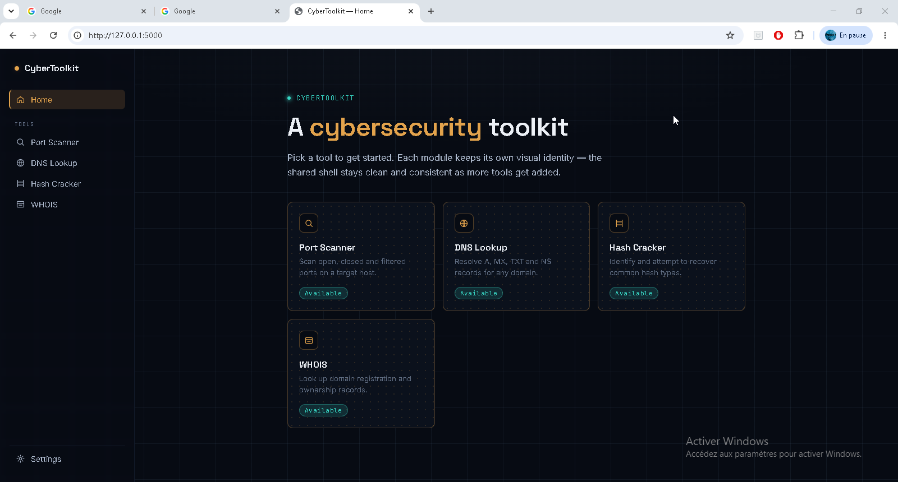
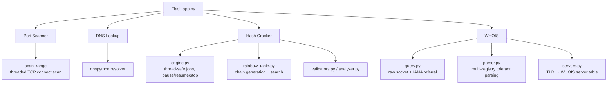
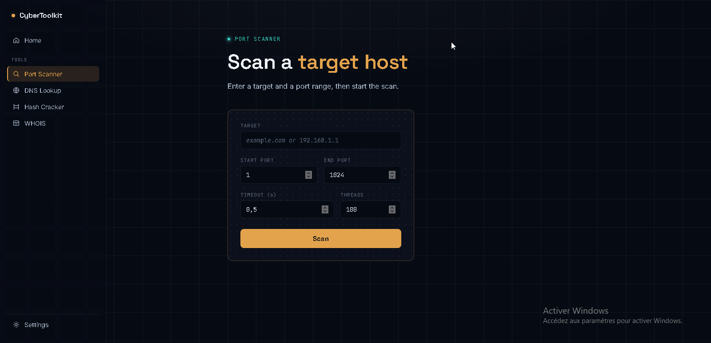
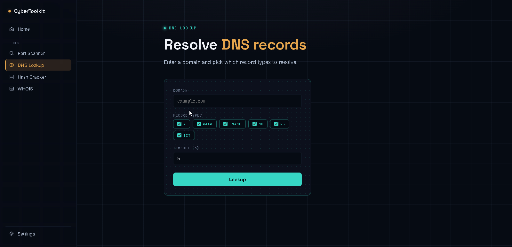
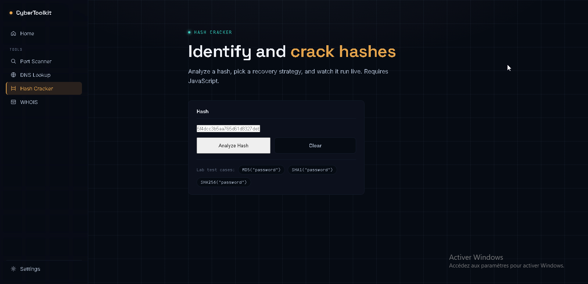
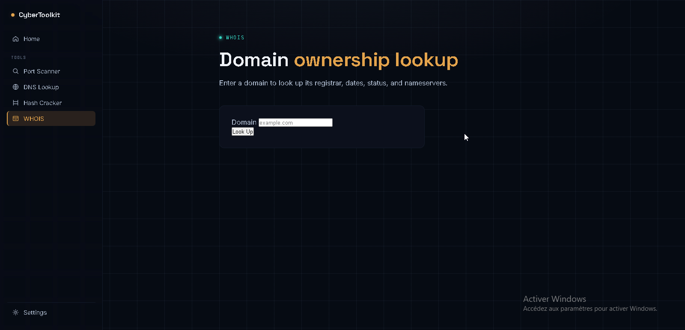

# 🛡️ CyberToolkit

**A modular, self-hosted cybersecurity toolkit built with Flask — port scanning, DNS enumeration, hash recovery, and WHOIS lookups, all from one clean interface.**




---

## Table of Contents

- [Overview](#overview)
- [Architecture](#architecture)
- [Engineering Highlights](#engineering-highlights)
- [Tools](#tools)
  - [Port Scanner](#-port-scanner)
  - [DNS Lookup](#-dns-lookup)
  - [Hash Cracker](#-hash-cracker)
  - [WHOIS](#-whois)
- [Installation](#installation)
- [Project Structure](#project-structure)
- [Testing](#testing)
- [Roadmap](#roadmap)
- [Legal & Ethical Use](#legal--ethical-use)
- [License](#license)

---

## Overview

CyberToolkit is a from-scratch cybersecurity toolkit built to explore how real security tools work under the hood — not by wrapping existing libraries, but by implementing the underlying protocols and algorithms directly: raw TCP sockets for port scanning and WHOIS, a real rainbow-table implementation with reduction functions for hash recovery, and a tolerant parser handling multiple WHOIS registry formats.

Every tool shares one Flask backend and one consistent design system, but is otherwise a fully independent, testable Python module with its own validation, engine, and test suite.

| Tool | What it does |
|---|---|
| 🔎 **Port Scanner** | TCP connect-scan across a port range, with known-service identification |
| 🌐 **DNS Lookup** | Resolves A / AAAA / MX / TXT / NS / CNAME records for any domain |
| 🔓 **Hash Cracker** | Identifies and attempts recovery of MD5/SHA-family hashes via dictionary, brute force, or a real rainbow table |
| 📇 **WHOIS** | Raw-socket WHOIS lookups with automatic server resolution and IANA referral following |

---

## Architecture



Each tool follows the same internal layering: **validators** (pure input checking, no I/O) → **engine** (the actual protocol/algorithm work) → **Flask route** (thin glue, no business logic). This keeps every module importable and testable with zero Flask dependency.

---

## Engineering Highlights

A few decisions worth calling out, since they're the parts that separate this from a basic CRUD wrapper:

- **A real rainbow table, not brute force in disguise.** `rainbow_table.py` implements actual reduction-function hash chains — a chain starts from a random plaintext, alternates hashing and reducing for N steps, and only the start/endpoint pair is stored. Lookup works backward from the target hash through possible chain positions. Coverage is probabilistic, exactly like a production rainbow table, and this was empirically verified (a table with ~11% theoretical coverage found ~11% of random samples in testing).
- **A thread-safe execution engine with true pause/resume/stop.** Hash-cracking jobs run in background threads controlled via `threading.Event` checkpoints, with live progress (candidates tested, speed, ETA) polled from the frontend — not a fire-and-forget script.
- **Feasibility is measured, not guessed.** Before running a brute-force job, the engine runs an invisible ~20,000-hash benchmark *on the machine actually executing it* to project a real completion time, and requires explicit confirmation if that estimate exceeds a safety threshold.
- **A WHOIS parser tolerant to real-world format chaos.** Verisign's `Creation Date:`, RIPE's `changed:`, and JPRS's bracketed `[Created on]` all resolve to the same structured field — validated against fixtures from all three formats plus malformed/redacted/not-found edge cases.
- **Progressive enhancement.** Port Scanner, DNS Lookup, and WHOIS all work with JavaScript disabled (full server-rendered fallback) — only Hash Cracker requires JS, since live progress/pause/stop has no meaningful non-JS equivalent.
- **Zero unnecessary dependencies.** Hash Cracker and WHOIS run entirely on the Python standard library (`socket`, `hashlib`, `re`, `threading`) — verified by running their full test suites in a virtual environment containing nothing but `pip`.

---

## Tools

### 🔎 Port Scanner

Multi-threaded TCP connect-scan across a configurable port range, with common-service name/description lookup and a live results table (open, closed, filtered).



---

### 🌐 DNS Lookup

Resolves A, AAAA, MX, TXT, NS, and CNAME records for any domain, with per-record-type status handling (found / no answer / NXDOMAIN / timeout) so one failing record type never breaks the whole lookup.



---

### 🔓 Hash Cracker

Identifies a hash's likely algorithm(s) from its length and format, then attempts recovery via three independent strategies:

- **Dictionary** — wordlist-based, with optional transformations (capitalize, leetspeak, suffixes)
- **Brute Force** — exhaustive search with a measured time estimate and a safety confirmation gate for unreasonably long runs
- **Rainbow Table** — real precomputed hash chains, with automatic salted-hash incompatibility detection
- **Automatic** — a sequential pipeline through the above, with a live step-by-step log

The demo below shows the **Brute Force** strategy end-to-end (live progress, speed, ETA); Dictionary, Rainbow Table, and Automatic follow the same analyze → configure → run → result flow.



---

### 📇 WHOIS

Speaks the raw WHOIS protocol (plain text over TCP port 43) directly — resolves the correct authoritative server per TLD, follows IANA referrals automatically, and parses the response into structured fields regardless of which registry's format it came from.



---

## Installation

```bash
git clone https://github.com/<velanox>/CyberToolkit.git
cd CyberToolkit

python -m venv venv
venv\Scripts\activate        # Windows
# source venv/bin/activate   # macOS/Linux

pip install -r requirements.txt

python app.py
```

Then open **http://localhost:5000** in your browser.

> ⚠️ This app is designed to run **locally**. See [Legal & Ethical Use](#legal--ethical-use) before pointing any tool at a target you don't own or have explicit permission to test.

---

## Project Structure

```
CyberToolkit/
├── app.py                      # Flask entry point — routes for every tool
├── requirements.txt
├── modules/
│   ├── port_scanner.py
│   ├── dns_lookup.py
│   ├── hash_cracker/
│   │   ├── engine.py           # Job / RainbowJob / thread-safe execution
│   │   ├── rainbow_table.py    # chain generation + search algorithm
│   │   ├── analyzer.py         # hash format identification
│   │   ├── validators.py
│   │   ├── algorithms.py
│   │   ├── candidates.py
│   │   ├── strategies/
│   │   └── tests.py
│   └── whois/
│       ├── whois_lookup.py     # single entry point
│       ├── query.py            # raw socket engine + referral following
│       ├── parser.py           # multi-registry tolerant parser
│       ├── servers.py          # TLD → WHOIS server resolution
│       ├── validators.py
│       └── tests.py
├── templates/                  # Jinja2 templates, one per tool
├── static/
│   ├── css/                    # shared design system + per-tool styles
│   └── js/                     # shared utilities + per-tool logic
├── wordlists/                  # bundled default wordlist
└── screenshots/                # README assets
```

---

## Testing

Hash Cracker and WHOIS each ship a standalone `unittest` suite requiring no Flask instance and no live network access (WHOIS network behavior is verified against a local fake socket server):

```bash
python -m unittest modules.hash_cracker.tests -v   # 47 tests
python -m unittest modules.whois.tests -v           # 49 tests
```

Coverage includes input validation, protocol/network edge cases (timeouts, DNS failures, malformed responses), algorithm correctness against known test vectors, and full end-to-end assembly — verified stable across repeated runs and in a clean virtual environment.

---

## Roadmap

Possible directions if this project continues to grow:

- [ ] bcrypt / crypt(3) hash support in Hash Cracker (currently identified but not attacked)
- [ ] Second-hop WHOIS referral following (registry → registrar-specific server)
- [ ] Persistent job queue for Hash Cracker (currently in-memory, lost on restart)
- [ ] IPv6 / ARIN-style WHOIS support
- [ ] Dockerized deployment

---

## Legal & Ethical Use

This toolkit is built for **learning, local testing, and authorized security assessments only**. Port scanning and hash recovery tools can be misused; do not run these tools against any host, network, or hash you do not own or do not have explicit, documented authorization to test. The author assumes no responsibility for misuse.

---

## License

Distributed under the **MIT License**. See `LICENSE` for details.